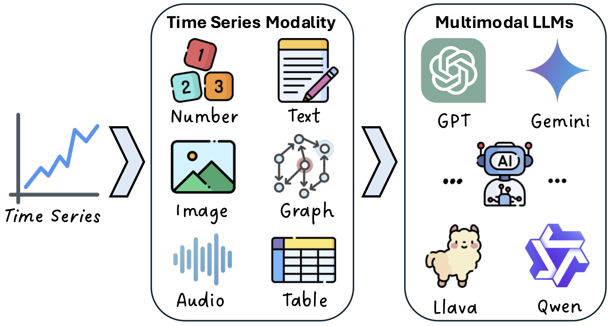

<div align="center">
  
# Awesome Multimodal LLMs for Time Series Analysis


</div>

<div align="center">

</div>

<p align="center"><b>Time series, traditionally represented as a temporally ordered sequence of numbers, can be flexibly expressed across diverse modalities, including text, images, graphs, audio, and tables</b></p>

## 👂**TL;DR**
- 🙋‍♂ This [paper list](#papers) compiles time series research in various modalities and representative MLLMs compatible with those modelities

## Table of Contents
- 💡 [About](#about)
- 📑 [Papers](#papers)
  - 📈 [Time Series Modalities](#time-series-modalities)
    - [Numbers](#numbers)
    - [Text](#text)
    - [Images](#images)
    - [Graphs](#graphs)
    - [Audio](#audio)
    - [Tables](#tables)
  - 🤖 [Representative Multimodal LLMs](#representative-multimodal-llms)
    - [Text & Image - compatible LLMs](#text--image---compatible-llms)
    - [Graph - compatible LLMs](#graph---compatible-llms)
    - [Audio - compatible LLMs](#audio---compatible-llms)
    - [Table - compatible LLMs](#table---compatible-llms)
- 🕑 [Future Directions](#future-directions)

## About
- We survey existing work from data and model perspectives: **time series modalities** and **multimodal LLMs**.
- From the data perspective, we emphasize that **time series**, traditionally represented as a temporally ordered sequence of **numbers**, can be flexibly expressed across diverse modalities, including **text, images, graphs, audio, and tables**
- From the model perspective, we introduce **representative MLLMs** that are either currently applicable or hold potential for specific time series modalities.

## Papers
### Time Series Modalities

#### Numbers
- **TimeGPT-1**  
    *Azul Garza, Cristian Challu, Max Mergenthaler-Canseco*.
    [[paper](https://arxiv.org/abs/2310.03589)] [[code](https://github.com/Nixtla/nixtla)]
- **Lag-llama: Towards foundation models for time series forecasting**  
  *Kashif Rasul, Arjun Ashok, Andrew Robert Williams, Hena Ghonia, Rishika Bhagwatkar, Arian Khorasani, Mohammad Javad Darvishi Bayazi, George Adamopoulos, Roland Riachi, Nadhir Hassen, Marin Biloš, Sahil Garg, Anderson Schneider, Nicolas Chapados, Alexandre Drouin, Valentina Zantedeschi, Yuriy Nevmyvaka, Irina Rish*.
    [[paper](https://arxiv.org/abs/2310.08278)] [[code](https://github.com/time-series-foundation-models/lag-llama)]
- **A decoder-only foundation model for time-series forecasting**  
    *Abhimanyu Das, Weihao Kong, Rajat Sen, Yichen Zhou*.
    [[paper](https://arxiv.org/abs/2310.10688)] [[code](https://github.com/google-research/timesfm)]
- **Timer: Generative Pre-trained Transformers Are Large Time Series Models**  
    *Yong Liu, Haoran Zhang, Chenyu Li, Xiangdong Huang, Jianmin Wang, Mingsheng Long*.
    [[paper](https://arxiv.org/abs/2402.02368)] [[code](https://github.com/thuml/Large-Time-Series-Model)]
- **Unified Training of Universal Time Series Forecasting Transformers**  
    *Gerald Woo, Chenghao Liu, Akshat Kumar, Caiming Xiong, Silvio Savarese, Doyen Sahoo*.
    [[paper](https://arxiv.org/abs/2402.02592)] [[code](https://github.com/SalesforceAIResearch/uni2ts)]
- **MOMENT: A Family of Open Time-series Foundation Models**  
    *Azul Garza, Cristian Challu, Max Mergenthaler-Canseco*.
    [[paper](https://arxiv.org/abs/2402.03885)] [[code](https://github.com/moment-timeseries-foundation-model/moment)]
- **Chronos: Learning the language of time series**  
    *Abdul Fatir Ansari, Lorenzo Stella, Caner Turkmen, Xiyuan Zhang, Pedro Mercado, Huibin Shen, Oleksandr Shchur, Syama Sundar Rangapuram, Sebastian Pineda Arango, Shubham Kapoor, Jasper Zschiegner, Danielle C. Maddix, Hao Wang, Michael W. Mahoney, Kari Torkkola, Andrew Gordon Wilson, Michael Bohlke-Schneider, Yuyang Wang*.
    [[paper](https://arxiv.org/abs/2403.07815)] [[code](https://github.com/amazon-science/chronos-forecasting)]
- **Tiny Time Mixers (TTMs): Fast Pre-trained Models for Enhanced Zero/Few-Shot Forecasting of Multivariate Time Series**  
  *Vijay Ekambaram, Arindam Jati, Pankaj Dayama, Sumanta Mukherjee, Nam H. Nguyen, Wesley M. Gifford, Chandra Reddy, Jayant Kalagnanam*.
  [[paper](https://arxiv.org/abs/2401.03955)] [[code](https://github.com/ibm-granite/granite-tsfm/tree/main/tsfm_public/models/tinytimemixer)]
- **Time-MoE: Billion-Scale Time Series Foundation Models with Mixture of Experts**  
  *Xiaoming Shi, Shiyu Wang, Yuqi Nie, Dianqi Li, Zhou Ye, Qingsong Wen, Ming Jin*.
  [[paper](https://arxiv.org/abs/2409.16040)] [[code](https://github.com/Time-MoE/Time-MoE)]
- **Pre-training Time Series Models with Stock Data Customization**  
  *Mengyu Wang, Tiejun Ma, Shay B. Cohen*.
  [[paper](https://www.arxiv.org/abs/2506.16746)] [[code](https://github.com/astudentuser/Pre-training-Time-Series-Models-with-Stock-Data-Customization)]

#### Text
- **PromptCast: A New Prompt-based Learning Paradigm for Time Series Forecasting**  
    *Hao Xue, Flora D. Salim*.
    [[paper](https://arxiv.org/abs/2210.08964)] [[code](https://github.com/HaoUNSW/PISA)]
- **One Fits All:Power General Time Series Analysis by Pretrained LM**  
    *Tian Zhou, PeiSong Niu, Xue Wang, Liang Sun, Rong Jin*.
    [[paper](https://arxiv.org/abs/2302.11939)] [[code](https://github.com/DAMO-DI-ML/NeurIPS2023-One-Fits-All)]
- **LLM4TS: Aligning Pre-Trained LLMs as Data-Efficient Time-Series Forecasters**  
    *Ching Chang, Wei-Yao Wang, Wen-Chih Peng, Tien-Fu Chen*.
    [[paper](https://arxiv.org/abs/2308.08469)]
- **TEST: Text Prototype Aligned Embedding to Activate LLM's Ability for Time Series**  
    *Chenxi Sun, Hongyan Li, Yaliang Li, Shenda Hong*.
    [[paper](https://arxiv.org/abs/2308.08241)] [[code](https://github.com/SCXsunchenxi/TEST)]
- **Time-LLM: Time Series Forecasting by Reprogramming Large Language Models**  
    *Ming Jin, Shiyu Wang, Lintao Ma, Zhixuan Chu, James Y. Zhang, Xiaoming Shi, Pin-Yu Chen, Yuxuan Liang, Yuan-Fang Li, Shirui Pan, Qingsong Wen*.
    [[paper](https://arxiv.org/abs/2310.01728)] [[code](https://github.com/KimMeen/Time-LLM)]
- **TEMPO: Prompt-based Generative Pre-trained Transformer for Time Series Forecasting**  
    *Defu Cao, Furong Jia, Sercan O Arik, Tomas Pfister, Yixiang Zheng, Wen Ye, Yan Liu*.
    [[paper](https://arxiv.org/abs/2310.04948)] [[code](https://github.com/DC-research/TEMPO)]
- **Large Language Models Are Zero-Shot Time Series Forecasters**  
    *Nate Gruver, Marc Finzi, Shikai Qiu, Andrew Gordon Wilson*.
    [[paper](https://arxiv.org/abs/2310.07820)] [[code](https://github.com/ngruver/llmtime)]
- **UniTime: A Language-Empowered Unified Model for Cross-Domain Time Series Forecasting**  
    *Xu Liu, Junfeng Hu, Yuan Li, Shizhe Diao, Yuxuan Liang, Bryan Hooi, Roger Zimmermann*.
    [[paper](https://arxiv.org/abs/2310.09751)] [[code](https://github.com/liuxu77/UniTime)]
- **LSTPrompt: Large Language Models as Zero-Shot Time Series Forecasters by Long-Short-Term Prompting**  
    *Haoxin Liu, Zhiyuan Zhao, Jindong Wang, Harshavardhan Kamarthi, B. Aditya Prakash*.
    [[paper](https://arxiv.org/abs/2402.16132)] [[code](https://github.com/AdityaLab/lstprompt)]
- **S^2IP-LLM: Semantic Space Informed Prompt Learning with LLM for Time Series Forecasting**  
    *Zijie Pan, Yushan Jiang, Sahil Garg, Anderson Schneider, Yuriy Nevmyvaka, Dongjin Song*.
    [[paper](https://arxiv.org/abs/2403.05798)] [[code](https://github.com/panzijie825/S2IP-LLM)]
- **Advancing Time Series Classification with Multimodal Language Modeling**  
    *Mingyue Cheng, Yiheng Chen, Qi Liu, Zhiding Liu, Yucong Luo*.
    [[paper](https://arxiv.org/abs/2403.12371)] [[code](https://github.com/Mingyue-Cheng/InstructTime)]
- **GPT4MTS: Prompt-based Large Language Model for Multimodal Time-series Forecasting**  
    *Furong Jia, Kevin Wang, Yixiang Zheng, Defu Cao, Yan Liu*.
    [[paper](https://ojs.aaai.org/index.php/AAAI/article/view/30383)]
- **TimeCMA: Towards LLM-Empowered Multivariate Time Series Forecasting via Cross-Modality Alignment**  
    *Chenxi Liu, Qianxiong Xu, Hao Miao, Sun Yang, Lingzheng Zhang, Cheng Long, Ziyue Li, Rui Zhao*.
    [[paper](https://arxiv.org/abs/2406.01638)] [[code](https://github.com/ChenxiLiu-HNU/TimeCMA)]
- **ChatTime: A Unified Multimodal Time Series Foundation Model Bridging Numerical and Textual Data**  
    *Chengsen Wang, Qi Qi, Jingyu Wang, Haifeng Sun, Zirui Zhuang, Jinming Wu, Lei Zhang, Jianxin Liao*.
    [[paper](https://arxiv.org/abs/2412.11376)] [[code](https://github.com/ForestsKing/ChatTime)]
- **Context-Alignment: Activating and Enhancing LLM Capabilities in Time Series**  
    *Yuxiao Hu, Qian Li, Dongxiao Zhang, Jinyue Yan, Yuntian Chen*.
    [[paper](https://arxiv.org/abs/2501.03747)]
- **Random Initialization Can’t Catch Up: The Advantage of Language Model Transfer for Time Series Forecasting**  
    *Roland Riachi, Kashif Rasul, Arjun Ashok, Prateek Humane, Alexis Roger, Andrew R. Williams, Yuriy Nevmyvaka, Irina Rish*.
    [[paper](https://arxiv.org/abs/2506.21570)]
- **Leveraging Language Foundation Models for Human Mobility Forecasting**  
    *Hao Xue, Bhanu Prakash Voutharoja, Flora D. Salim*.
    [[paper](https://arxiv.org/abs/2209.05479)] [[code](https://github.com/cruiseresearchgroup/AuxMobLCast)]
- **Where Would I Go Next? Large Language Models as Human Mobility Predictors**  
    *Xinglei Wang, Meng Fang, Zichao Zeng, Tao Cheng*.
    [[paper](https://arxiv.org/abs/2308.15197)] [[code](https://github.com/xlwang233/LLM-Mob)]
- **Towards Explainable Traffic Flow Prediction with Large Language Models**  
    *Xusen Guo, Qiming Zhang, Junyue Jiang, Mingxing Peng, Meixin Zhu, Hao (Frank) Yang*.
    [[paper](https://arxiv.org/abs/2404.02937)] [[code](https://github.com/Guoxs/xTP-LLM)]
- **The Wall Street Neophyte: A Zero-Shot Analysis of ChatGPT Over MultiModal Stock Movement Prediction Challenges**  
    *Qianqian Xie, Weiguang Han, Yanzhao Lai, Min Peng, Jimin Huang*.
    [[paper](https://arxiv.org/abs/2304.05351)]
- **Can ChatGPT Forecast Stock Price Movements? Return Predictability and Large Language Models**  
    *Alejandro Lopez-Lira, Yuehua Tang*.
    [[paper](https://arxiv.org/abs/2304.07619)]
- **Temporal Data Meets LLM -- Explainable Financial Time Series Forecasting**  
    *Xinli Yu, Zheng Chen, Yuan Ling, Shujing Dong, Zongyi Liu, Yanbin Lu*.
    [[paper](https://arxiv.org/abs/2306.11025)]
- **Frozen Language Model Helps ECG Zero-Shot Learning**  
    *Jun Li, Che Liu, Sibo Cheng, Rossella Arcucci, Shenda Hong*.
    [[paper](https://arxiv.org/abs/2303.12311)]
- **Large Language Models are Few-Shot Health Learners**  
    *Xin Liu, Daniel McDuff, Geza Kovacs, Isaac Galatzer-Levy, Jacob Sunshine, Jiening Zhan, Ming-Zher Poh, Shun Liao, Paolo Di Achille, Shwetak Patel*.
    [[paper](https://arxiv.org/abs/2305.15525)]
- **MedTsLLM: Leveraging LLMs for Multimodal Medical Time Series Analysis**  
    *Nimeesha Chan, Felix Parker, William Bennett, Tianyi Wu, Mung Yao Jia, James Fackler, Kimia Ghobadi*.
    [[paper](https://arxiv.org/abs/2408.07773)] [[code](https://github.com/flixpar/med-ts-llm)]

#### Images
- **Insight Miner: A Time Series Analysis Dataset for Cross-Domain Alignment with Natural Language**  
    *Yunkai Zhang, Yawen Zhang, Ming Zheng, Kezhen Chen, Chongyang Gao, Ruian Ge, Siyuan Teng, Amine Jelloul, Jinmeng Rao, Xiaoyuan Guo, Chiang-Wei Fang, Zeyu Zheng, Jie Yang*.
    [[paper](https://openreview.net/forum?id=E1khscdUdH&referrer=%5Bthe%20profile%20of%20Yunkai%20Zhang%5D(%2Fprofile%3Fid%3D~Yunkai_Zhang2))] [[dataset](https://drive.google.com/drive/folders/1qGXigxE5GvmF1oLuGXaqLMkRgwoQfZ7V)]
- **TimeSeriesExam: A time series understanding exam**  
    *Yifu Cai, Arjun Choudhry, Mononito Goswami, Artur Dubrawski*.
    [[paper](https://arxiv.org/abs/2410.14752)] [[code](https://github.com/moment-timeseries-foundation-model/TimeSeriesExam)]
- **Plots Unlock Time-Series Understanding in Multimodal Models**  
    *Mayank Daswani, Mathias M.J. Bellaiche, Marc Wilson, Desislav Ivanov, Mikhail Papkov, Eva Schnider, Jing Tang, Kay Lamerigts, Gabriela Botea, Michael A. Sanchez, Yojan Patel, Shruthi Prabhakara, Shravya Shetty, Umesh Telang*.
    [[paper](https://arxiv.org/abs/2410.02637)]
- **Can LLMs Understand Time Series Anomalies?**  
    *Zihao Zhou, Rose Yu*.
    [[paper](https://arxiv.org/abs/2410.05440)] [[code](https://github.com/Rose-STL-Lab/AnomLLM/)]
- **See it, Think it, Sorted: Large Multimodal Models are Few-shot Time Series Anomaly Analyzers**  
    *Jiaxin Zhuang, Leon Yan, Zhenwei Zhang, Ruiqi Wang, Jiawei Zhang, Yuantao Gu*.
    [[paper](https://arxiv.org/abs/2411.02465)]
- **A Picture is Worth A Thousand Numbers: Enabling LLMs Reason about Time Series via Visualization**  
    *Haoxin Liu, Chenghao Liu, B. Aditya Prakash*.
    [[paper](https://arxiv.org/abs/2411.06018)]
- **On the Feasibility of Vision-Language Models for Time-Series Classification**  
    *Vinay Prithyani, Mohsin Mohammed, Richa Gadgil, Ricardo Buitrago, Vinija Jain, Aman Chadha*.
    [[paper](https://arxiv.org/abs/2412.17304)] [[code](https://github.com/vinayp17/VLM_TSC)]
- **Time Series as Images: Vision Transformer for Irregularly Sampled Time Series**  
    *Zekun Li, Shiyang Li, Xifeng Yan*.
    [[paper](https://arxiv.org/abs/2303.12799)] [[code](https://github.com/Leezekun/ViTST)]
- **Multimodal LLMs for health grounded in individual-specific data**  
    *Anastasiya Belyaeva, Justin Cosentino, Farhad Hormozdiari, Krish Eswaran, Shravya Shetty, Greg Corrado, Andrew Carroll, Cory Y. McLean, Nicholas A. Furlotte*.
    [[paper](https://arxiv.org/abs/2307.09018)]
- **Harnessing Vision-Language Models for Time Series Anomaly Detection**  
    *Zelin He, Sarah Alnegheimish, Matthew Reimherr*.
    [[paper](https://arxiv.org/abs/2506.06836)] [[code](https://github.com/ZLHe0/VLM4TS)]

#### Graphs
- **GATGPT: A Pre-trained Large Language Model with Graph Attention Network for Spatiotemporal Imputation**  
    *Yakun Chen, Xianzhi Wang, Guandong Xu*.
    [[paper](https://arxiv.org/abs/2311.14332)]
- **Spatio-Temporal Graph Learning with Large Language Model**  
    *Qianru Zhang, Xubin Ren, Lianghao Xia, Siu Ming Yiu, Chao Huang*.
    [[paper](https://openreview.net/forum?id=QUkcfqa6GX)]
- **Spatio-Temporal Graph Convolutional Network Combined Large Language Model: A Deep Learning Framework for Bike Demand Forecasting**  
    *Peisen Li, Yizhe Pang, Junyu Ren*.
    [[paper](https://arxiv.org/abs/2403.15733)]
- **Strada-LLM: Graph LLM for traffic prediction**  
    *Seyed Mohamad Moghadas, Yangxintong Lyu, Bruno Cornelis, Alexandre Alahi, Adrian Munteanu*.
    [[paper](https://arxiv.org/abs/2410.20856v1)]
- **LLM-based Online Prediction of Time-varying Graph Signals**  
    *Dayu Qin, Yi Yan, Ercan Engin Kuruoglu*.
    [[paper](https://arxiv.org/abs/2410.18718)]
- **ChatGPT Informed Graph Neural Network for Stock Movement Prediction**  
    *Zihan Chen, Lei Nico Zheng, Cheng Lu, Jialu Yuan, Di Zhu*.
    [[paper](https://arxiv.org/abs/2306.03763)] [[code](https://github.com/ZihanChen1995/ChatGPT-GNN-StockPredict)]
- **Language Knowledge-Assisted Representation Learning for Skeleton-Based Action Recognition**  
    *Haojun Xu, Yan Gao, Zheng Hui, Jie Li, Xinbo Gao*.
    [[paper](https://arxiv.org/abs/2305.12398)] [[code](https://github.com/damNull/LAGCN)]

#### Audio
- **Voice2Series: Reprogramming Acoustic Models for Time Series Classification**  
    *Chao-Han Huck Yang, Yun-Yun Tsai, Pin-Yu Chen*.
    [[paper](https://arxiv.org/abs/2106.09296)] [[code](https://github.com/huckiyang/Voice2Series-Reprogramming)]

#### Tables
- **TableTime: Reformulating Time Series Classification as Training-Free Table Understanding with Large Language Models**  
    *Jiahao Wang, Mingyue Cheng, Qingyang Mao, Yitong Zhou, Feiyang Xu, Xin Li*.
    [[paper](https://arxiv.org/abs/2411.15737)] [[code](https://github.com/realwangjiahao/tabletime)]
- **The Tabular Foundation Model TabPFN Outperforms Specialized Time Series Forecasting Models Based on Simple Features**  
    *Shi Bin Hoo, Samuel Müller, David Salinas, Frank Hutter*.
    [[paper](https://arxiv.org/abs/2501.02945)] [[code](https://github.com/liam-sbhoo/tabpfn-time-series)]

### Representative Multimodal LLMs
#### Text & Image - compatible LLMs
- **GPT-4 Technical Report**  
    *OpenAI*.
    [[paper](https://arxiv.org/abs/2303.08774)]
- **Gemini 1.5: Unlocking multimodal understanding across millions of tokens of context**  
    *Gemini Team Google*.
    [[paper](https://arxiv.org/abs/2403.05530)]
- **Claude 3 Haiku: our fastest model yet**  
    *Anthropic*.
    [[blog](https://www.anthropic.com/news/claude-3-haiku)]
- **The Llama 3 Herd of Models**  
    *Meta AI Llama Team*.
    [[paper](https://arxiv.org/abs/2407.21783)] [[code](https://github.com/meta-llama/llama3)]
- **Qwen2-VL: Enhancing Vision-Language Model’s Perception of the World at Any Resolution**  
    *Qwen Team Alibaba Group*.
    [[paper](https://arxiv.org/abs/2409.12191)] [[code](https://github.com/QwenLM/Qwen2.5-VL)]
- **Expanding Performance Boundaries of Open-Source Multimodal Models with Model, Data, and Test-Time Scaling**  
    *Zhe Chen, Weiyun Wang, Yue Cao, Yangzhou Liu, Zhangwei Gao, Erfei Cui, Jinguo Zhu, Shenglong Ye, Hao Tian, Zhaoyang Liu, Lixin Gu, Xuehui Wang, Qingyun Li, Yimin Ren, Zixuan Chen, Jiapeng Luo, Jiahao Wang, Tan Jiang, Bo Wang, Conghui He, Botian Shi, Xingcheng Zhang, Han Lv, Yi Wang, Wenqi Shao, Pei Chu, Zhongying Tu, Tong He, Zhiyong Wu, Huipeng Deng, Jiaye Ge, Kai Chen, Kaipeng Zhang, Limin Wang, Min Dou, Lewei Lu, Xizhou Zhu, Tong Lu, Dahua Lin, Yu Qiao, Jifeng Dai, Wenhai Wang*.
    [[paper](https://arxiv.org/abs/2412.05271)] [[code](https://github.com/OpenGVLab/InternVL)]

#### Graph - compatible LLMs
- **How Can Large Language Models Understand Spatial-Temporal Data?**  
    *Lei Liu, Shuo Yu, Runze Wang, Zhenxun Ma, Yanming Shen*.
    [[paper](https://arxiv.org/abs/2401.14192)]
- **UrbanGPT: Spatio-Temporal Large Language Models**  
    *Zhonghang Li, Lianghao Xia, Jiabin Tang, Yong Xu, Lei Shi, Long Xia, Dawei Yin, Chao Huang*.
    [[paper](https://arxiv.org/abs/2403.00813)] [[code](https://github.com/HKUDS/UrbanGPT)]
- **STD-PLM: Understanding Both Spatial and Temporal Properties of Spatial-Temporal Data with PLM**  
    *YiHeng Huang, Xiaowei Mao, Shengnan Guo, Yubin Chen, Junfeng Shen, Tiankuo Li, Youfang Lin, Huaiyu Wan*.
    [[paper](https://arxiv.org/abs/2407.09096)]

#### Audio - compatible LLMs
- **SpeechGPT: Empowering Large Language Models with Intrinsic Cross-Modal Conversational Abilities**  
    *Dong Zhang, Shimin Li, Xin Zhang, Jun Zhan, Pengyu Wang, Yaqian Zhou, Xipeng Qiu*.
    [[paper](https://arxiv.org/abs/2305.11000)] [[code](https://github.com/0nutation/SpeechGPT)]
- **AudioGPT: Understanding and Generating Speech, Music, Sound, and Talking Head**  
    *Rongjie Huang, Mingze Li, Dongchao Yang, Jiatong Shi, Xuankai Chang, Zhenhui Ye, Yuning Wu, Zhiqing Hong, Jiawei Huang, Jinglin Liu, Yi Ren, Zhou Zhao, Shinji Watanabe*.
    [[paper](https://arxiv.org/abs/2304.12995)] [[code](https://github.com/AIGC-Audio/AudioGPT)]
- **MinMo: A Multimodal Large Language Model for Seamless Voice Interaction**  
    *Qian Chen, Yafeng Chen, Yanni Chen, Mengzhe Chen, Yingda Chen, Chong Deng, Zhihao Du, Ruize Gao, Changfeng Gao, Zhifu Gao, Yabin Li, Xiang Lv, Jiaqing Liu, Haoneng Luo, Bin Ma, Chongjia Ni, Xian Shi, Jialong Tang, Hui Wang, Hao Wang, Wen Wang, Yuxuan Wang, Yunlan Xu, Fan Yu, Zhijie Yan, Yexin Yang, Baosong Yang, Xian Yang, Guanrou Yang, Tianyu Zhao, Qinglin Zhang, Shiliang Zhang, Nan Zhao, Pei Zhang, Chong Zhang, Jinren Zhou*.
    [[paper](https://arxiv.org/abs/2501.06282)]

#### Table - compatible LLMs
- **TabPFN: A Transformer That Solves Small Tabular Classification Problems in a Second**  
    *Noah Hollmann, Samuel Müller, Katharina Eggensperger, Frank Hutter*.
    [[paper](https://arxiv.org/abs/2207.01848)] [[code](https://github.com/PriorLabs/TabPFN)]
- **TableLlama: Towards Open Large Generalist Models for Tables**  
    *Tianshu Zhang, Xiang Yue, Yifei Li, Huan Sun*.
    [[paper](https://arxiv.org/abs/2311.09206)] [[code](https://github.com/OSU-NLP-Group/TableLlama)]
- **TableGPT2: A Large Multimodal Model with Tabular Data Integration**  
    *Aofeng Su, Aowen Wang, Chao Ye, Chen Zhou, Ga Zhang, Gang Chen, Guangcheng Zhu, Haobo Wang, Haokai Xu, Hao Chen, Haoze Li, Haoxuan Lan, Jiaming Tian, Jing Yuan, Junbo Zhao, Junlin Zhou, Kaizhe Shou, Liangyu Zha, Lin Long, Liyao Li, Pengzuo Wu, Qi Zhang, Qingyi Huang, Saisai Yang, Tao Zhang, Wentao Ye, Wufang Zhu, Xiaomeng Hu, Xijun Gu, Xinjie Sun, Xiang Li, Yuhang Yang, Zhiqing Xiao*.
    [[paper](https://arxiv.org/abs/2411.02059)] [[code](https://github.com/tablegpt/tablegpt-agent)]

## Future Directions
### Video
  - **Deep Video Prediction for Time Series Forecasting**  
    *Zhen Zeng, Tucker Balch, Manuela Veloso*.
    [[paper](https://arxiv.org/abs/2102.12061)]

### Reasoning
- **Language Models Still Struggle to Zero-shot Reason about Time Series**  
    *Mike A. Merrill, Mingtian Tan, Vinayak Gupta, Tom Hartvigsen, Tim Althoff*.
    [[paper](https://arxiv.org/abs/2404.11757)] [[code](https://github.com/behavioral-data/TSandLanguage)]
- **Towards Time Series Reasoning with LLMs**  
    *Winnie Chow, Lauren Gardiner, Haraldur T. Hallgrímsson, Maxwell A. Xu, Shirley You Ren*.
    [[paper](https://arxiv.org/abs/2409.11376)]
- **Position: Empowering Time Series Reasoning with Multimodal LLMs**  
    *Yaxuan Kong, Yiyuan Yang, Shiyu Wang, Chenghao Liu, Yuxuan Liang, Ming Jin, Stefan Zohren, Dan Pei, Yan Liu, Qingsong Wen*.
    [[paper](https://arxiv.org/abs/2502.01477)]
- **Evaluating System 1 vs. 2 Reasoning Approaches for Zero-Shot Time Series Forecasting: A Benchmark and Insights**  
    *Haoxin Liu, Zhiyuan Zhao, Shiduo Li, B. Aditya Prakash*.
    [[paper](https://arxiv.org/abs/2503.01895)] [[code](https://github.com/AdityaLab/OpenTimeR)]
- **Time-R1: Towards Comprehensive Temporal Reasoning in LLMs**  
    *Zijia Liu, Peixuan Han, Haofei Yu, Haoru Li, Jiaxuan You*.
    [[paper](https://arxiv.org/abs/2505.13508)] [[code](https://github.com/ulab-uiuc/Time-R1)]
- **Time Series Forecasting as Reasoning: A Slow-Thinking Approach with Reinforced LLMs**  
    *Yucong Luo, Yitong Zhou, Mingyue Cheng, Jiahao Wang, Daoyu Wang, Tingyue Pan, Jintao Zhang*.
    [[paper](https://arxiv.org/abs/2506.10630)] [[code](https://github.com/lqzxt/Time-R1)]
- **Can Large Language Models Adequately Perform Symbolic Reasoning Over Time Series?**  
    *Zewen Liu, Juntong Ni, Xianfeng Tang, Max S.Y. Lau, Wenpeng Yin, Wei Jin*.
    [[paper](https://arxiv.org/abs/2508.03963)]


### Agents
- **Agentic Retrieval-Augmented Generation for Time Series Analysis**  
    *Chidaksh Ravuru, Sagar Srinivas Sakhinana, Venkataramana Runkana*.
    [[paper](https://arxiv.org/abs/2408.14484)]
- **Argos: Agentic Time-Series Anomaly Detection with Autonomous Rule Generation via Large Language Models**  
    *Yile Gu, Yifan Xiong, Jonathan Mace, Yuting Jiang, Yigong Hu, Baris Kasikci, Peng Cheng*.
    [[paper](https://arxiv.org/abs/2501.14170)]
- **LLM Knows Geometry Better than Algebra: Numerical Understanding of LLM-Based Agents in A Trading Arena**  
    *Tianmi Ma, Jiawei Du, Wenxin Huang, Wenjie Wang, Liang Xie, Xian Zhong, Joey Tianyi Zhou*.
    [[paper](https://arxiv.org/abs/2502.17967)] [[code](https://github.com/wekjsdvnm/Agent-Trading-Arena)]
- **FinArena: A Human-Agent Collaboration Framework for Financial Market Analysis and Forecasting**  
    *Congluo Xu, Zhaobin Liu, Ziyang Li*.
    [[paper](https://arxiv.org/abs/2503.02692)]


### Interpretability and Hallucination
- **Large Language Models can Deliver Accurate and Interpretable Time Series Anomaly Detection**  
    *Jun Liu, Chaoyun Zhang, Jiaxu Qian, Minghua Ma, Si Qin, Chetan Bansal, Qingwei Lin, Saravan Rajmohan, Dongmei Zhang*.
    [[paper](https://arxiv.org/abs/2405.15370)] [[code](https://github.com/LJunius/LLMAD)]
- **Can LLMs Serve As Time Series Anomaly Detectors?**  
    *Manqing Dong, Hao Huang, Longbing Cao*.
    [[paper](https://arxiv.org/abs/2408.03475)]

## 👏 Contributing to this paper list
There may be cases where we overlook important work in this rapidly evolving field. Please feel free to share your awesome work or relevant contributions here! Thanks in advance for your efforts!

## 📝 Citation  
If you find our work useful, please cite the below paper:
```bibtex
@article{xu2025beyond,
  title={Beyond Numbers: A Survey of Time Series Analysis in the Era of Multimodal LLMs},
  author={Xu, Xiongxiao and Zhao, Yue and Philip, S Yu and Shu, Kai},
  journal={Authorea Preprints},
  year={2025},
  publisher={Authorea}
}
```
